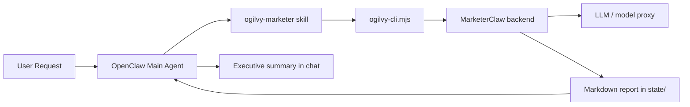

# Ogilvy for OpenClaw

A marketing agent for OpenClaw that converts plain-language marketing requests into structured multi-agent deliverables.

**Best for:** Marketing, operations, PR, content, and e-commerce professionals.
**Best scenarios:** competitor analysis, marketing strategy, audience insight, content matrix, GTM, campaign brief, budget management, risk monitoring.

## Why this exists

Most assistants can brainstorm marketing ideas in chat. Very few can reliably turn fuzzy requests into a reusable workflow that:
- routes to a dedicated marketing agent
- runs through a backend workflow engine
- saves long-form output to disk
- returns a clean executive summary instead of flooding the conversation

Ogilvy is that layer.

## Core capabilities

- **Dedicated marketing skill** for OpenClaw
- **Portable CLI wrapper** around a MarketerClaw backend
- **Environment-variable based config** instead of machine-specific paths
- **Long report to `state/`** and short answer in chat
- **Packaged `.skill` artifact** for easy sharing
- **GitHub Actions packaging workflow** for distribution

## Repository layout

```text
projects/ogilvy-openclaw-agent/
├── README.md
├── README.zh-CN.md
├── LICENSE
├── .gitignore
├── install.sh
├── examples/
│   └── example.env
├── .github/
│   └── workflows/
│       └── package-skill.yml
├── skill/
│   └── ogilvy-marketer/
│       ├── SKILL.md
│       ├── scripts/
│       │   └── ogilvy-cli.mjs
│       └── references/
│           └── templates.md
└── dist/
    └── ogilvy-marketer.skill
```

## Architecture



## Requirements

- OpenClaw
- Node.js 18+
- **MarketerClaw backend** (multi-agent workflow engine) — running and reachable
- **LLM proxy** (OpenAI-compatible endpoint) — for role models
- Optional: `xiaohongshu-skills` for Xiaohongshu data scraping

## Dependencies

Ogilvy Agent is a **scheduler + CLI wrapper**. It depends on:

| Dependency | Purpose | Default Port |
|------------|---------|--------------|
| MarketerClaw backend | Multi-agent marketing workflow engine | `:8787` (configurable) |
| LLM proxy | OpenAI-compatible model endpoint | `:8999/v1` (configurable) |
| `xiaohongshu-skills` (optional) | Xiaohongshu competitor scraping | N/A (called via MarketerClaw) |

**Note**: If you install Ogilvy without these dependencies, it will fail with connection errors.

## Quick start

### 1) Configure runtime endpoints

```bash
# MarketerClaw backend (your local instance)
export OGILVY_MARKETERCLAW_URL="http://<your-host>:<your-port>"

# LLM proxy (OpenAI-compatible)
export OGILVY_LLM_BASE_URL="http://<your-llm-proxy>:<port>/v1"

# API key for LLM proxy
export OGILVY_LLM_API_KEY="<your-api-key>"

# Default model for marketing workflows
export OGILVY_DEFAULT_MODEL="bailian/qwen3.5-plus"
```

**Replace placeholders** with your actual deployment addresses. Default local development ports are `:8787` (MarketerClaw) and `:8999` (LLM proxy).

Optional tuning:

```bash
export OGILVY_TEMPERATURE="0.7"
export OGILVY_MAX_TOKENS="4000"
export OGILVY_TIMEOUT_MS="120000"
```

### 2) Install the skill

Option A: copy the skill directly.

```bash
cp -R skill/ogilvy-marketer ~/.openclaw/workspace/skills/
```

Option B: use the helper installer.

```bash
bash install.sh ~/.openclaw/workspace
```

Option C: import the packaged artifact if your environment supports `.skill` files.

## Usage in OpenClaw

Ask for things like:
- "Do a Xiaohongshu competitor analysis"
- "Build a launch strategy for this product"
- "Create a content matrix and audience insight memo"
- "Analyze competitors and give me an execution plan"

Expected behavior:
1. The skill converts the request into a compact structured brief.
2. The CLI calls the MarketerClaw backend.
3. A long markdown report is saved to `state/`.
4. Chat returns an executive summary, key warnings, and the file path.

## CLI example

```bash
node skill/ogilvy-marketer/scripts/ogilvy-cli.mjs \
  --projectName "Perfume Brand Xiaohongshu Competitor Research" \
  --productName "Perfume Product" \
  --brief "Analyze competitor content strategy on Xiaohongshu and produce recommendations" \
  --templateId content_matrix_cn \
  --out ../../state/competitor-research-report.md
```

## Template guide

- `launch_cn`: product launch / GTM / message house / phased launch
- `promotion_cn`: promo push / shopping festivals / conversion campaigns
- `content_matrix_cn`: social content planning / competitor scanning / always-on seeding
- `weekly_report_cn`: recap / optimization / reporting

## Example output pattern

Typical output returned in chat:
- executive summary
- major risks or compliance warnings
- saved report path

Typical output saved to disk:
- structured markdown report
- multi-role workflow output
- strategic recommendations and action items

## FAQ

### Why save the long report to `state/` instead of chat?
Because marketing workflows often produce long outputs. Keeping the full report on disk makes it easier to review, version, and reuse while keeping chat readable.

### What if my backend schema differs?
Adjust `skill/ogilvy-marketer/scripts/ogilvy-cli.mjs` to match your required payload fields, model prefixes, or workflow controls.

### What if the backend is unreachable?
The CLI will fail clearly and print the endpoint it tried. Check `OGILVY_MARKETERCLAW_URL` first.

### Can I use another model provider?
Yes, as long as your endpoint is OpenAI-compatible or your backend accepts the provided model configuration.

### Can I publish this as a standalone GitHub repo?
Yes. This folder was intentionally structured to be extracted into its own repository.

## Packaging

To rebuild the distributable `.skill` package:

```bash
python3 <openclaw-root>/skills/skill-creator/scripts/package_skill.py skill/ogilvy-marketer dist
```

A GitHub Actions workflow is included at `.github/workflows/package-skill.yml`.

## Security review notes

What has been intentionally checked before public release:
- no hardcoded personal filesystem paths
- no real API keys committed
- runtime endpoints are environment-variable driven
- packaged artifact is rebuildable from source
- installation uses a local workspace target instead of machine-specific assumptions

## License

MIT
