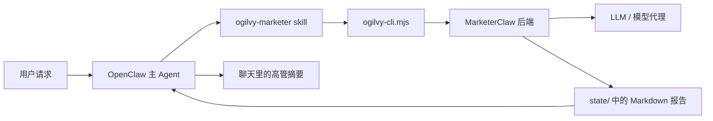

# Ogilvy for OpenClaw

一个面向 OpenClaw 的可移植营销 Agent，用来把自然语言营销需求稳定地转成结构化多智能体交付物。

**最适合的场景：** 竞品分析、新品上市、用户洞察、内容矩阵、GTM、campaign brief。

## 这个项目解决什么问题

大多数 AI 助手都能在聊天里“写一点营销建议”。
但很少有方案能把模糊需求真正变成一条可复用工作流，并且同时满足：

- 路由到一个独立营销 Agent
- 调用后端工作流引擎
- 把长报告落盘保存
- 聊天里只回高管摘要，而不是刷屏

Ogilvy 就是这一层。

## 核心能力

- **OpenClaw 独立营销 Skill**
- **MarketerClaw 的可移植 CLI 包装层**
- **基于环境变量配置**，不依赖机器私有路径
- **完整报告写入 `state/`**，对话只保留摘要
- **支持打包成 `.skill` 分发**
- **自带 GitHub Actions 打包流程**

## 仓库结构

```text
projects/ogilvy-openclaw-agent/
├── README.md
├── README.zh-CN.md
├── LICENSE
├── .gitignore
├── install.sh
├── examples/
│   └── example.env
├── .github/
│   └── workflows/
│       └── package-skill.yml
├── skill/
│   └── ogilvy-marketer/
│       ├── SKILL.md
│       ├── scripts/
│       │   └── ogilvy-cli.mjs
│       └── references/
│           └── templates.md
└── dist/
    └── ogilvy-marketer.skill
```

## 架构图



## 依赖

- OpenClaw
- Node.js 18+
- 可访问的 MarketerClaw API
- 一个 OpenAI-compatible 的模型端点或代理

## 快速开始

### 1）配置运行时环境变量

```bash
export OGILVY_MARKETERCLAW_URL="http://127.0.0.1:8787"
export OGILVY_LLM_BASE_URL="http://127.0.0.1:8999/v1"
export OGILVY_LLM_API_KEY="test-key"
export OGILVY_DEFAULT_MODEL="bailian/qwen3.5-plus"
```

可选调优：

```bash
export OGILVY_TEMPERATURE="0.7"
export OGILVY_MAX_TOKENS="4000"
export OGILVY_TIMEOUT_MS="120000"
```

### 2）安装 skill

方式一：直接复制。

```bash
cp -R skill/ogilvy-marketer ~/.openclaw/workspace/skills/
```

方式二：运行安装脚本。

```bash
bash install.sh ~/.openclaw/workspace
```

方式三：如果你的环境支持 `.skill` 导入，可以直接使用打包产物。

## 在 OpenClaw 中怎么用

你可以直接说：
- “做一份小红书竞品分析”
- “给这个新品做上市营销方案”
- “帮我规划一个内容矩阵和人群洞察”
- “分析竞品打法并输出执行建议”

预期行为：
1. Skill 把请求整理成结构化 brief
2. CLI 调用 MarketerClaw 后端
3. 长 Markdown 报告保存到 `state/`
4. 聊天里只返回摘要、风险提醒和文件路径

## CLI 调用示例

```bash
node skill/ogilvy-marketer/scripts/ogilvy-cli.mjs \
  --projectName "馥生六记小红书竞品研究" \
  --productName "馥生六记香水" \
  --brief "分析小红书竞品内容打法，输出内容策略" \
  --templateId content_matrix_cn \
  --out ../../state/fushengliuji-report.md
```

## 模板说明

- `launch_cn`：新品上市 / GTM / 信息屋 / 分阶段发布
- `promotion_cn`：节点大促 / 转化战役 / ROI 导向活动
- `content_matrix_cn`：社媒内容矩阵 / 竞品扫描 / 日常种草
- `weekly_report_cn`：周报复盘 / 优化建议 / 阶段汇总

## 输出形态

聊天中通常返回：
- 高管摘要
- 关键风险或合规提醒
- 报告文件路径

落盘文件通常包含：
- 结构化 Markdown 报告
- 多角色节点输出
- 策略建议与执行动作

## FAQ

### 为什么长报告不直接发在聊天里？
因为营销工作流通常很长。把完整报告写入 `state/` 更适合复盘、版本管理和复用，同时能保持对话干净。

### 如果我的后端 schema 不一样怎么办？
修改 `skill/ogilvy-marketer/scripts/ogilvy-cli.mjs` 即可，按你的后端要求调整 payload 字段、模型前缀或 workflowControl。

### 如果后端连不上怎么办？
CLI 会明确报错并打印它访问的 endpoint。优先检查 `OGILVY_MARKETERCLAW_URL`。

### 可以接别的模型供应商吗？
可以。只要你的 endpoint 是 OpenAI-compatible，或者后端接受当前的模型配置结构即可。

### 可以直接公开成单独 GitHub 仓库吗？
可以。这个目录就是按“可独立抽出”为目标整理的。

## 打包

重新生成 `.skill` 分发包：

```bash
python3 <openclaw-root>/skills/skill-creator/scripts/package_skill.py skill/ogilvy-marketer dist
```

仓库中已经包含 GitHub Actions：`.github/workflows/package-skill.yml`。

## 发布前检查清单

- [ ] 把当前目录抽成独立仓库
- [ ] 补仓库描述和 tags
- [ ] 在 Secrets 或本地 `.env` 中配置运行时地址
- [ ] 确认 CI 能成功打包 `.skill`
- [ ] 不要提交真实 API key

## License

MIT
